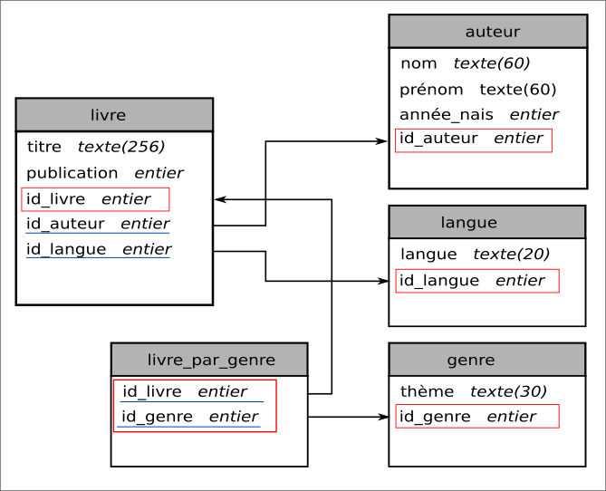

TP : SGBD SQLite
================

SQLite est un ensemble de programmes qui permet de gérer des bases de données. Ces programmes sont à la fois serveur et client. Il est possible d'uitliser la ligne de commandes pour créer et gérer ses tables mais il existe aussi une interface graphique téléchargeable : SQLite Browser.

.. note::

    SQLite Browser peut être installé sur sa machine ou alors utilisé sur une clé USB grace à sa version portable. 

On va créer une base de données selon le modèle relationnel vu dans la première partie du cours. On redonne le schéma relationnel de notre base de donnée.

#.  Installer sur votre clé usb le fichier SQLite Browser téléchargeable sur l'ENT ou directement depuis le site de SQLite. 

    .. note:: 
        
        Si vous n'avez pas de clé usb, il faut installer SQLite Browser dans le dossier `C:\\temp` de votre machine.

#.  Ouvrir l'application `SQLite Browser` et créer une nouvelle base de données ``romans``.
#.  Créer une première table nommée ``livre`` avec les attributs ``titre`` de type texte et ``publication`` de type entier associé à l'année de publication du roman. Ajouter l'attibut ``id_livre`` qui est une clé primaire auto-incrémentée.

    .. figure:: ../img/bdd_romans_table_livre.png
        :align: center
        :width: 100%

        création de la table livre

#.  Créer de la même façon les tables ``auteur``, ``langue`` et ``genre`` avec leurs attributs respectifs.

#.  Il faut lier les tables ``livre`` et ``auteur`` entre elles avec la clé étrangère ``id_auteur``. Il faut donc ajouter la clé primaire ``id_auteur`` de la table auteur en clé étrangère à la table ``livre``. Cette clé étrangère est aussi nommée ``id_auteur``. 

    L'ajout de la clé étrangère ``id_auteur`` se fait en 2 temps.

    a)  Sélectionner la table ``livre`` puis cliquer sur le bouton ``Modifier table`` puis ajouter un nouvel attribut ``id_auteur``. 
    
    En fin de ligne, il faut compléter le champ ``clé étrangère`` en selectionnant la table référenceé et la clé primaire utilisée. Ici, on sélectionne la table ``auteur`` et la clé primaire ``id_auteur``.

    .. figure:: ../img/cle_etrangere_1.png
        :align: center
        :width: 560

    b)  Sélectionner l'onglet ``Contraintes`` et cliquer sur ``Ajouter une contrainte`` en sélectionnant la valeur ``clé étrangère``. Ensuite, ajouter le nom de la clé dans le champ ``colonne``. Enregistrer les modifications.

    .. figure:: ../img/cle_etrangere_2.png
        :align: center
        :width: 560

#.  Ajouter les autres clés étrangères de la table ``livre``.
#.  Pour lier la ``table`` livre et la table ``genre``, il faut créer la table ``livre_par_genre``.

    a)  Créer la table ``livre_par_genre`` en ajoutant les 2 attributs ``id_livre`` et ``id_genre``.
    b)  Ajouter le couple ``(id_livre,id_genre)`` comme clé primaire de la table.
    c)  Déclarer comme clés étrangères les 2 clés ``id_livre`` et ``id_genre`` en référençant les tables.

Les tables sont construites. Il faut maintenant les alimenter. L'interface graphique permet de compléter assez facilement les données. Les bases de données relationnel utilisent leur propre langage pour effectuer des requêtes et des actions sur les bases de données. C'est le langage SQL.

.. rubric:: Insérer de nouvelles valeurs

On insère des valeurs dans une table avec l'instruction SQL suivante:

.. code:: SQL

    INSERT INTO `table (attribut_1, ..., atribut_n)` VALUES (valeur_1, ..., valeur_n)

.. caution::

    -   Il est possible de ne pas préciser les attributs mais les valeurs doivent être dans le même ordre que les attributs de la table.
    -   Si on précise les attributs, on peut changer l'ordre !

.. rubric:: Mettre à jour (modifier) des enregistrements

On modifie des valeurs dans une table avec l'instruction SQL suivante:

.. code:: SQL

    UPDATE table SET attribut = "nouvelle valeur" WHERE attribut = "ancienne valeur"

.. caution::

    -   Si on ne précise pas l'ancienne valeur de l'attribut avec la clause `WHERE`, tous les enregistrements de la table sont modifiés.

#.  Compléter les tables en utilisant les romans de l'activité sur le modèle relationnel.
#.  On souhaite ajouter l'auteure Joanne Rowling née en 1965.
    a)  Insérer cet enregistrement avec une requête SQL .
    b)  Vérifier que l'enregistrement est dans la table auteur.
#.  Ajouter le roman "Harry Potter à l'école des sorciers" édité en 1998 en anglais avec une requête SQL.
#.  Écrire une requête SQL qui modifie le titre du roman "Blade runner" par le titre original.
